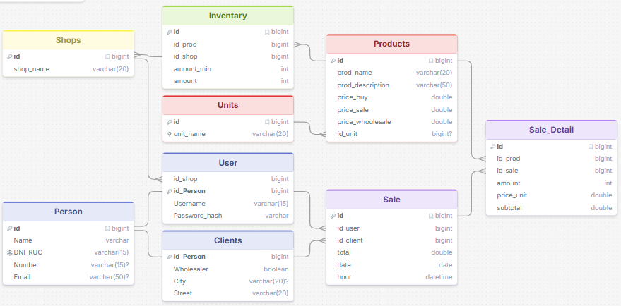
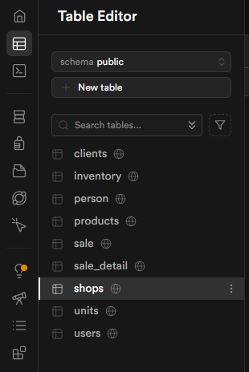
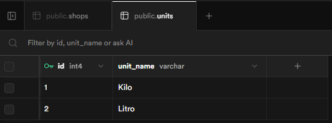

# LabDaw
---
* [Lab 03](#)
* [Lab 05](#)
* [Lab 06](#-laboratorio-6-base-de-datos)
---
## Laboratorio 6 Base de Datos
### Solución a un problema real
El problema es la creación de un sistema de ventas con varias sedes y que puede ser atendido por varios usuarios
### Elaboración del modelo lógico DER

El modelo lógico fue creado utilizando [DrawSQL](https://drawsql.app/teams/shovy/diagrams/lab06)
### Implementación del modelo fisico PostgreSQL
```sql
CREATE TABLE person (
    id SERIAL PRIMARY KEY,
    "name" VARCHAR(50) NOT NULL,
    dni_ruc VARCHAR(15) UNIQUE NOT NULL,
    "number" VARCHAR(15),
    email VARCHAR(50)
);
CREATE TABLE shops (
    id SERIAL PRIMARY KEY,
    shop_name VARCHAR(20) NOT NULL,
    street VARCHAR(20)
);
```
[Ver codigo completo](./Lab06/DataBase.sql)
### Implementación en Supabase
Con el codigo en SQL puro, se ejecuta en un projecto para la creación de las tablas

Y se preba el funcionamiento con SQL Editor:
```sql
INSERT INTO clients (id_person, wholesaler, city) VALUES (1, true, 'Arequipa');
INSERT INTO shops (shop_name) VALUES ('Tienda 1');
INSERT INTO units (unit_name) VALUES ('Kilo');
INSERT INTO units (unit_name) VALUES ('Litro');
```

